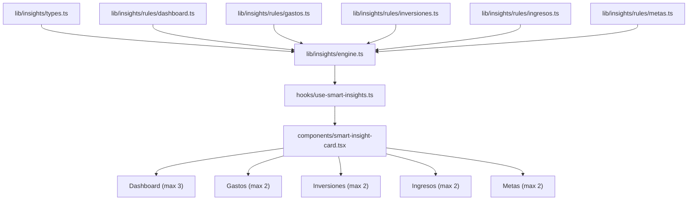
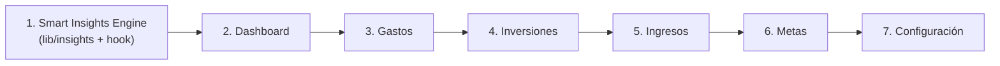

# Fase 3: Traducción a Componentes React — Plan de Implementación

## Resumen Ejecutivo

Esta fase traduce el prototipo HTML aprobado a componentes React/Next.js de producción. El principio rector es: **la UI cambia, el motor queda**. Toda la lógica existente (React Query, Supabase Realtime, SSR Hydration, Offline-First) se mantiene intacta.

Se estructura en dos ejes:
1. **Smart Insights Engine** — Nuevo sistema de insights inteligentes para todos los módulos
2. **Refactorización de UI** — Traducción del prototipo HTML a `.tsx` con los requisitos específicos por módulo

---

## Parte 1: Motor de Smart Insights

### 1.1 Arquitectura



### 1.2 Tipos Base

```typescript
// lib/insights/types.ts

export type InsightCategory = "tip" | "reminder" | "opportunity" | "warning" | "achievement";

export type InsightModule = "dashboard" | "gastos" | "inversiones" | "ingresos" | "metas";

export type InsightPriority = "critical" | "high" | "medium" | "low";

export interface SmartInsight {
  id: string;                    // Unique: "{ruleId}-{hash(params)}"
  ruleId: string;                // e.g. "gastos-daily-pace"
  module: InsightModule;         // Módulo destino
  category: InsightCategory;     // Tipo visual (color + icono)
  priority: InsightPriority;     // Para ordenamiento
  title: string;                 // Título corto (max ~40 chars)
  message: string;               // Descripción con datos interpolados
  href?: string;                 // Deep link al módulo relevante
  icon?: string;                 // Lucide icon name override
  dismissible: boolean;          // ¿Se puede cerrar?
  createdAt: string;             // ISO date
}

// Context para evaluar reglas — se arma una vez con todos los datos del usuario
export interface InsightContext {
  // Gastos
  expenses: Expense[];
  expensesPrevMonth: Expense[];
  
  // Ingresos
  incomes: Income[];
  incomesPrevMonth: Income[];
  compositeDistribution: IncomeDistribution | null;
  
  // Inversiones / Portfolio
  holdings: ValuedHolding[];
  portfolioTotals: PortfolioTotals;
  returnSeries: ReturnPoint[];
  investments: Investment[];
  
  // Metas
  goals: Goal[];
  goalProgresses: Map<string, GoalProgress>;
  
  // Tarjetas
  creditCards: CreditCard[];
  
  // Fechas
  today: Date;
  currentMonth: Date;
  daysInMonth: number;
  dayOfMonth: number;
}

export type InsightRule = {
  id: string;
  module: InsightModule;
  evaluate: (ctx: InsightContext) => SmartInsight | null;
};
```

### 1.3 Motor Central

```typescript
// lib/insights/engine.ts

export function evaluateInsights(
  ctx: InsightContext,
  rules: InsightRule[],
  dismissed: Set<string>,         // IDs descartados (localStorage por mes)
  maxPerModule: Record<InsightModule, number>
): Record<InsightModule, SmartInsight[]> {
  // 1. Evaluar todas las reglas → pool de insights
  // 2. Filtrar dismissed
  // 3. Ordenar por prioridad (critical > high > medium > low)
  // 4. Limitar por módulo según maxPerModule
  // 5. Retornar agrupado por módulo
}
```

### 1.4 Persistencia de Descartados

- **Storage key**: `fime-dismissed-insights-{YYYY-MM}`
- **Contenido**: `Set<string>` de insight IDs
- Se resetea automáticamente cada mes
- Se persiste en `localStorage` (no en Supabase, es preferencia de UI)

### 1.5 Hook de React

```typescript
// hooks/use-smart-insights.ts

export function useSmartInsights(module?: InsightModule): {
  insights: SmartInsight[];       // Ya filtrados y limitados para el módulo
  allInsights: Record<InsightModule, SmartInsight[]>;
  dismiss: (insightId: string) => void;
  isLoading: boolean;
}
```

El hook consume todos los hooks existentes (useExpenses, useIncomes, usePortfolio, useGoals, etc.) internamente para armar el `InsightContext`. **No duplica lógica de fetching**, solo reutiliza los hooks.

---

### 1.6 Reglas por Módulo

#### 📊 Dashboard (máx. 3 insights)

| ID | Categoría | Prioridad | Regla | Mensaje ejemplo |
|---|---|---|---|---|
| `dash-savings-rate-low` | warning | high | Tasa de ahorro del mes < 10% | "Tu tasa de ahorro este mes es del 5%. Intentá superar el 15% para mantener tu colchón." |
| `dash-expense-spike` | warning | high | Gasto total del mes > 120% del mes anterior | "Gastaste un 35% más que el mes pasado. Revisá tus gastos variables." |
| `dash-card-due-soon` | reminder | high | Tarjeta vence en ≤ 5 días | "Tu tarjeta Visa vence en 3 días. Total estimado: $45,000." |
| `dash-no-expenses-logged` | reminder | medium | Han pasado > 3 días sin registrar gastos | "Hace 4 días que no registrás gastos. ¿Querés cargar los pendientes?" |
| `dash-surplus-invest` | opportunity | medium | Flujo libre del mes > 30% de ingresos | "Tenés $180,000 de flujo libre. ¿Querés invertirlo?" |
| `dash-goal-achievable` | opportunity | low | Una meta puede completarse con el flujo libre actual | "'Vacaciones Japón' necesita $2,285 más. ¡Tu flujo libre lo cubre!" |
| `dash-month-closing` | reminder | low | Quedan ≤ 3 días del mes | "Quedan 2 días para cerrar el mes. Revisá que no falten gastos." |
| `dash-no-investments` | tip | low | No hay inversiones registradas | "¿Sabías que invertir regularmente puede multiplicar tus ahorros? Empezá con un DCA." |

#### 💸 Gastos (máx. 2 insights)

| ID | Categoría | Prioridad | Regla | Mensaje ejemplo |
|---|---|---|---|---|
| `gastos-daily-pace` | warning | critical | Ritmo diario de gasto > 110% del promedio histórico (mes pasado / días) | "Al ritmo actual, vas a gastar $520K este mes, un 25% más que el mes pasado." |
| `gastos-category-spike` | warning | high | Una categoría creció > 50% vs. mes anterior | "Gastaste un 65% más en Comida que el mes pasado." |
| `gastos-fixed-ratio` | tip | high | Gastos fijos > 60% de ingresos del mes | "Tus gastos fijos representan el 68% de tus ingresos. Lo ideal es mantenerlos bajo el 50%." |
| `gastos-subscription-review` | tip | medium | Total de gastos tipo "tarjeta_credito" con nota de suscripción > N meses seguidos | "Tenés $15,000/mes en suscripciones recurrentes. ¿Usás todas?" |
| `gastos-budget-exceeded` | warning | high | El presupuesto teórico (distribución × ingreso) de Fijos o Variables fue superado | "Superaste tu presupuesto de gastos variables por $23,000 (115% del objetivo)." |
| `gastos-category-concentration` | tip | low | Una sola categoría > 40% del gasto total | "El 45% de tus gastos son de Alquiler. ¿Podés optimizar otros gastos para compensar?" |

#### 📈 Inversiones (máx. 2 insights)

| ID | Categoría | Prioridad | Regla | Mensaje ejemplo |
|---|---|---|---|---|
| `inv-concentration` | warning | high | Un activo > 30% del portfolio (excl. USD cash) | "SPY representa el 42% de tu cartera. Considerá diversificar." |
| `inv-no-bonds` | tip | medium | No hay bonos ni ONs en el portfolio | "No tenés renta fija. Agregar bonos puede reducir la volatilidad." |
| `inv-single-type` | tip | medium | > 80% del portfolio en un solo asset_type | "El 85% de tu cartera está en acciones US. Diversificá con cripto o bonos." |
| `inv-unrealized-loss` | warning | high | Algún holding con P&L < −20% | "BTC tiene una pérdida no realizada del −25%. ¿Querés revisar tu tesis?" |
| `inv-cash-heavy` | opportunity | medium | USD cash > 40% del portfolio | "Tenés el 52% en cash. El efectivo pierde valor con la inflación." |
| `inv-dca-gap` | reminder | medium | Última compra hace > 30 días y hay DCA detectado (≥ 3 compras del mismo ticker) | "Hace 35 días que no comprás SPY. ¿Querés mantener tu DCA?" |
| `inv-performance-beats-sp500` | achievement | low | TWR del portfolio > S&P 500 en últimos 30 días | "¡Tu portfolio rindió un 8.2% este mes, superando al S&P 500 (5.1%)!" |
| `inv-all-stocks` | tip | low | 100% en acciones (sin cripto, sin bonos, sin cash) | "Tu portfolio es 100% acciones. Considerá añadir otras clases de activos." |

#### 💰 Ingresos (máx. 2 insights)

| ID | Categoría | Prioridad | Regla | Mensaje ejemplo |
|---|---|---|---|---|
| `ing-distribution-drift` | warning | high | Distribución real (gastos fijos vs. variables) difiere > 15pp del presupuesto teórico | "Tu presupuesto asigna 40% a fijos, pero gastás el 58%. Ajustá tu distribución." |
| `ing-income-drop` | warning | high | Ingresos del mes < 80% del mes anterior | "Tus ingresos bajaron un 30% vs. el mes pasado. Revisá si falta cargar algo." |
| `ing-freelance-irregular` | tip | medium | Ingresos freelance con coef. de variación > 0.3 (últimos 3 meses) | "Tus ingresos freelance varían mucho. El promedio de 3 meses es $250,000." |
| `ing-income-growth` | achievement | low | Ingresos del mes > 110% del anterior | "¡Tus ingresos crecieron un 15% este mes! Considerá aumentar tu inversión." |
| `ing-no-distribution-set` | reminder | medium | Hay ingresos del mes sin distribución configurada | "Tenés 2 ingresos sin distribución. Configurala para planificar mejor." |
| `ing-invest-ratio-low` | tip | low | % inversión en distribución compuesta < 10% | "Solo destinás el 8% a inversiones. ¿Podés subir al 15-20%?" |

#### 🎯 Metas (máx. 2 insights)

| ID | Categoría | Prioridad | Regla | Mensaje ejemplo |
|---|---|---|---|---|
| `meta-behind-pace` | warning | critical | Meta con pacing negativo (ETA > deadline) | "'Jubilación' está retrasada. Necesitás $800/mes extra para cumplirla." |
| `meta-milestone` | achievement | high | Meta alcanzó 25%, 50% o 75% | "¡'Vacaciones Japón' alcanzó el 50%! Falta $2,500." |
| `meta-stale` | reminder | medium | Meta activa sin cambio en current_amount en > 30 días | "Hace 45 días que 'Fondo de emergencia' no progresa." |
| `meta-asset-link-suggestion` | opportunity | medium | Meta tipo savings/purchase sin linked_asset_keys y hay holdings que podrían cubrir > 10% del objetivo | "Vincular tu tenencia de ETH ($3,200) a 'Vacaciones Japón' cubriría el 64%." |
| `meta-achievable-with-surplus` | opportunity | low | Flujo libre del mes puede completar una meta al 80%+ | "'Vacaciones' necesita $1,000 más. ¡Tu flujo libre lo cubre!" |
| `meta-deadline-near` | reminder | high | Deadline en ≤ 30 días y progreso < 80% | "'Compra laptop' vence en 15 días y está al 62%." |

---

### 1.7 Componente de UI Compartido

```typescript
// components/smart-insight-card.tsx
// Diseño del prototipo HTML: tarjeta con borde izquierdo de color,
// icono, título, mensaje, botón de descarte (✕), y deep link opcional.

// Colores por categoría:
// - tip:         amber border, amber icon
// - reminder:    blue border, blue icon  
// - opportunity: emerald border, emerald icon
// - warning:     rose border, rose icon
// - achievement: violet border, violet icon
```

---

## Parte 2: Refactorización de UI por Módulo

> **Regla de oro**: Los archivos `page.tsx` (Server Components) NO se tocan. Todos los cambios son en los Client Components (`*-client.tsx`) y en los componentes de `components/`.

### 2.1 Estrategia de Preservación de Lógica

| Capa | Acción |
|---|---|
| `types/database.ts` | Sin cambios (excepto adiciones para nuevos features) |
| `lib/**` | Sin cambios (excepto nuevo `lib/insights/`) |
| `hooks/**` | Sin cambios |
| `app/**/page.tsx` (SSR) | Sin cambios |
| `app/**/*-client.tsx` | Se reescriben con nuevo layout del prototipo HTML |
| `components/**` | Se restylizan para matchear el prototipo. Lógica interna intacta |
| `components/ui/**` | Sin cambios (primitivos shadcn) |

### 2.2 Orden de Ejecución



---

### 2.3 Dashboard

#### Cambios de UI (prototipo → React):
- **HeroKpis**: Aplicar nuevo diseño con gradientes por KPI, stealth toggle, sparkline background
- **NUEVO: SmartInsightsCarousel**: Carrusel horizontal de máx. 3 insights (reemplaza `AlertsPanel` actual)
- **GoalsStrip → Metas Principales Widget**: 2 columnas de mini-donuts con datos reales
- **NUEVO: Salud Financiera Gauge**: Indicador circular con score calculado
- **PortfolioSnapshot**: Rediseñar con mini-donut + mini TWR chart
- **CashflowSankey**: Se mantiene con restyling
- **ActivityFeed**: Se mantiene con restyling

#### Lógica que se preserva:
- Todo el SSR prefetching de [page.tsx](file:///c:/Users/Lauti/Documents/CLAUDE/fime/app/page.tsx)
- [useDashboardAlerts](file:///c:/Users/Lauti/Documents/CLAUDE/fime/lib/dashboard/alerts.ts) se depreca gradualmente, reemplazado por `useSmartInsights("dashboard")`
- Hooks de `useExpenses`, `useIncomes`, `usePortfolio`, `useGoals` — sin cambios

#### Archivos afectados:
- `[MODIFY]` [dashboard-client.tsx](file:///c:/Users/Lauti/Documents/CLAUDE/fime/app/dashboard-client.tsx) — Nuevo layout
- `[MODIFY]` [hero-kpis.tsx](file:///c:/Users/Lauti/Documents/CLAUDE/fime/components/dashboard/hero-kpis.tsx) — Restyling
- `[NEW]` `components/dashboard/smart-insights-carousel.tsx`
- `[NEW]` `components/dashboard/health-gauge.tsx`
- `[MODIFY]` [goals-strip.tsx](file:///c:/Users/Lauti/Documents/CLAUDE/fime/components/dashboard/goals-strip.tsx) — Convertir a widget 2-col con mini-donuts
- `[MODIFY]` [portfolio-snapshot.tsx](file:///c:/Users/Lauti/Documents/CLAUDE/fime/components/dashboard/portfolio-snapshot.tsx) — Restyling
- `[MODIFY]` [cashflow-sankey.tsx](file:///c:/Users/Lauti/Documents/CLAUDE/fime/components/dashboard/cashflow-sankey.tsx) — Restyling
- `[MODIFY]` [activity-feed.tsx](file:///c:/Users/Lauti/Documents/CLAUDE/fime/components/dashboard/activity-feed.tsx) — Restyling
- `[DEPRECATE]` [alerts-panel.tsx](file:///c:/Users/Lauti/Documents/CLAUDE/fime/components/dashboard/alerts-panel.tsx) → Reemplazado por smart-insights-carousel

---

### 2.4 Gastos

#### Cambios de UI:
- Header con etiqueta "M1 · GASTOS" + selector de mes + botón QuickAdd
- Tarjetas de Gastos Fijos / Variables con **barras de progreso vs. presupuesto** (budget = distribución × ingresos del mes)
- Calendario de Pagos (próximos vencimientos de tarjetas)
- Top 3 Gastos del mes
- Suscripciones Activas (gastos recurrentes detectados)
- Donut de distribución por categoría
- Lista de movimientos
- Panel de Smart Insights (máx. 2)

#### Lógica que se preserva:
- `useExpenses(month)` — fetching, CRUD, realtime
- `sumExpensesByType()` — cálculo fijos vs variables
- Filtrado por categoría con `activeCategory`
- View mode calendar/list
- `useCreditCards()` para asociar gastos a tarjetas

#### Lógica nueva:
- **Budget progress bars**: Se calcula el presupuesto teórico como `distribución_compuesta.fixed_pct × total_ingresos_mes` para fijos, y `variable_pct × total_ingresos_mes` para variables. Esto conecta Gastos con Ingresos en tiempo real. Se necesita consumir `useIncomes(month)` desde el módulo de Gastos.

#### Archivos afectados:
- `[MODIFY]` Componentes en `components/gastos/` — Restyling
- `[NEW]` `components/gastos/budget-progress.tsx` — Barras de progreso
- `[NEW]` `components/gastos/payment-calendar.tsx` — Calendario de pagos
- `[NEW]` `components/gastos/top-expenses.tsx` — Top 3 gastos
- `[NEW]` `components/gastos/subscriptions.tsx` — Suscripciones detectadas
- `[NEW]` `components/gastos/gastos-insights.tsx` — Panel de insights

---

### 2.5 Inversiones

#### Cambios de UI:
- **Vista principal centrada en portfolios**: Hero card con gradiente mostrando portfolio total, P&L, y rendimiento
- **FX Ticker Strip**: Banda con tipos de cambio en tiempo real
- **Investment Tips Grid**: Grilla de Smart Insights (máx. 2)
- **Allocation Donut**: Donut de distribución por asset type
- **Performance Chart**: Gráfico TWR vs S&P 500
- **Holdings List**: Lista con sparklines por holding
- **Botón prominente `+ Nueva Operación`**: CTA principal en la parte superior

#### Cambio arquitectónico clave:
> **Historial de compras/ventas en Modal/Sheet**, no en la pantalla principal.

Actualmente Inversiones tiene 2 tabs: "Bitácora" (historial) y "Portfolio" (holdings). La propuesta es:
1. La **vista por defecto** muestra el Portfolio (holdings, donut, performance, tips)
2. Un **botón secundario "Ver Historial"** abre un `<Sheet>` lateral (desktop) o `<Dialog>` fullscreen (mobile) con la lista de transacciones y filtros

Esto elimina el tab system actual y limpia la pantalla principal.

#### Lógica que se preserva:
- `usePortfolio(portfolioId)` — holdings, totals, TWR
- `useInvestments()` — CRUD de transacciones
- `useFxRates()` — tipos de cambio
- `useQuotes()` — cotizaciones
- Portfolio selector (ALL / individual)
- Snapshot upsert automático
- Transfer asset entre portfolios

#### Archivos afectados:
- `[MODIFY]` `app/inversiones/[portfolioId]/page.tsx` — Mínimo cambio (si el SSR ya está ok)
- `[MODIFY]` `app/inversiones/[portfolioId]/*-client.tsx` — Nuevo layout sin tabs
- `[MODIFY]` Componentes en `components/inversiones/` y `components/portfolio/`
- `[NEW]` `components/inversiones/history-sheet.tsx` — Sheet/modal de historial
- `[NEW]` `components/inversiones/portfolio-hero.tsx` — Hero card con gradiente
- `[NEW]` `components/inversiones/investment-tips.tsx` — Smart Insights grid

---

### 2.6 Ingresos

#### Cambios de UI:
- Header con etiqueta "M4 · INGRESOS" + selector de mes
- Waterfall/Sankey de distribución teórica
- Cards de resumen (Ingresos, Gastos, Libre)
- Lista de movimientos
- Panel de Smart Insights (máx. 2)

#### Cambio clave: Distribución Teórica dinámica

> En el gráfico de "Distribución Teórica", los valores de "Gastos Fijos" y "Gastos Variables" **deben conectarse con los totales reales** del módulo de Gastos.

**Implementación**:
El componente `WaterfallSankey` ya recibe los datos de distribución. La modificación es:
1. El nodo "Gastos Fijos" muestra **dos valores**: el presupuestado (`fixed_pct × total_ingresos`) y el real (`sumExpensesByType("fixed")`)
2. El nodo "Gastos Variables" muestra lo mismo para variables
3. Si el gasto real supera el presupuesto → el nodo se pinta en rojo con indicador de exceso
4. El `WaterfallSankey` ya consume expenses (se pasan desde `IngresosClient`), pero ahora debe mostrar la comparación visual

```
Nodo "Gastos Fijos":
  Presupuesto: $200,000 (40% de $500,000)
  Real:        $230,000 ← rojo, +15%
```

#### Lógica que se preserva:
- `useIncomes(month)` — CRUD, distribución por ingreso
- `useExpenses(month)` — para alimentar los nodos de gastos reales (ya se hace hoy en el SSR prefetch)
- `compositeDistribution()` — cálculo ponderado
- Bulk update de distribución
- Templates one-click

#### Archivos afectados:
- `[MODIFY]` `components/ingresos/waterfall-sankey.tsx` — Agregar comparación presupuesto vs real
- `[MODIFY]` Componentes en `components/ingresos/` — Restyling
- `[NEW]` `components/ingresos/ingresos-insights.tsx` — Panel de insights

---

### 2.7 Metas

#### Cambios de UI:
- Nuevo diseño de tarjetas (GoalCard) con donuts sólidos (sin dots)
- Quest Board con tabs Main/Side
- Header con estadísticas y CTA

#### Nuevo Feature: Vincular Activos a Metas

> Permitir vincular holdings específicos (acciones, cripto, USD) a una meta para que el progreso se actualice dinámicamente.

**Implementación**:
La infraestructura ya existe parcialmente:
- `goals.linked_asset_keys: string[]` ya está en la DB ✅
- `source_type: "portfolio_subset"` ya está implementado en [progress.ts](file:///c:/Users/Lauti/Documents/CLAUDE/fime/lib/goals/progress.ts#L59-L65) ✅
- `computeCurrentAmount()` ya suma los holdings filtrados por `linked_asset_keys` ✅

Lo que falta es **la UI para vincular/desvincular activos**:

1. **En NewGoalDialog / EditGoalDialog**: Agregar un step/sección "Vincular Activos"
   - Muestra la lista de holdings actuales del portfolio con checkbox
   - Cada holding muestra: ticker, asset_type, valor actual en USD
   - Al seleccionar, se guardan los `key` (formato `{asset_type}:{ticker}`) en `linked_asset_keys`
   - Al guardar, se setea `source_type: "portfolio_subset"` automáticamente

2. **En GoalCard**: Mostrar chips con los activos vinculados
   - Cada chip muestra ticker + valor actual
   - Botón de "gestionar activos" que abre el dialog de edición

3. **Progreso automático**: Ya funciona vía `computeCurrentAmount()` — no requiere cambios en el motor

#### Lógica que se preserva:
- `useGoals()` — CRUD, realtime
- `computeGoalProgress()` — cálculo de progreso, pacing, ETA
- Quest types (main/side)
- Quick-add buttons (+10, +50, +100)

#### Archivos afectados:
- `[MODIFY]` [goal-card.tsx](file:///c:/Users/Lauti/Documents/CLAUDE/fime/components/metas/goal-card.tsx) — Nuevo diseño + chips de activos
- `[MODIFY]` [new-goal-dialog.tsx](file:///c:/Users/Lauti/Documents/CLAUDE/fime/components/metas/new-goal-dialog.tsx) — Agregar step de vincular activos
- `[MODIFY]` [edit-goal-dialog.tsx](file:///c:/Users/Lauti/Documents/CLAUDE/fime/components/metas/edit-goal-dialog.tsx) — Agregar sección de vincular activos
- `[MODIFY]` [quest-board.tsx](file:///c:/Users/Lauti/Documents/CLAUDE/fime/components/metas/quest-board.tsx) — Restyling
- `[MODIFY]` [progress-ring.tsx](file:///c:/Users/Lauti/Documents/CLAUDE/fime/components/metas/progress-ring.tsx) — Donut sólido sin dots
- `[NEW]` `components/metas/asset-linker.tsx` — Componente de vinculación de activos
- `[NEW]` `components/metas/metas-insights.tsx` — Panel de insights

---

### 2.8 Configuración

#### Cambios de UI:
- Implementar **exactamente** como el prototipo HTML
- Profile section con avatar picker y nombre
- Personalización: tema (deep-gray/OLED), acento, densidad
- Tarjetas de crédito: formulario y lista
- Push notifications toggle
- Stealth mode toggle

#### Lógica que se preserva:
- `usePreferences()` — tema, densidad, accent, stealth
- `useCreditCards()` — CRUD de tarjetas
- Avatar picker existente
- Push notification subscription
- Passkey management

#### Archivos afectados:
- `[MODIFY]` Componentes en `components/config/` — Restyling completo
- Todos los sub-componentes de perfil, personalización, tarjetas

---

## Parte 3: Cálculo de "Salud Financiera"

El gauge de Salud Financiera del Dashboard necesita un algoritmo. Propuesta:

```
Score = 0..100

Componentes (ponderación):
├── Tasa de Ahorro (25%)
│   └── >20% = 100pts, 15-20% = 80pts, 10-15% = 50pts, <10% = 20pts
├── Diversificación Portfolio (20%)
│   └── HHI < 0.15 = 100pts, 0.15-0.25 = 70pts, 0.25-0.40 = 40pts, >0.40 = 10pts
├── Gastos Fijos / Ingreso (20%)
│   └── <40% = 100pts, 40-50% = 70pts, 50-60% = 40pts, >60% = 10pts
├── Progreso de Metas (20%)
│   └── Promedio de pct de metas activas (0..100)
├── Consistencia de Registro (15%)
│   └── Días con gastos registrados / días transcurridos del mes * 100
```

Resultado visual: Gauge semicircular con color (rojo < 40, naranja 40-65, verde > 65) + label (Bajo / Medio / Bueno / Excelente).

---

## Parte 4: Resumen de Archivos Nuevos

| Archivo | Propósito |
|---|---|
| `lib/insights/types.ts` | Tipos del motor de insights |
| `lib/insights/engine.ts` | Motor central de evaluación |
| `lib/insights/rules/dashboard.ts` | 8 reglas Dashboard |
| `lib/insights/rules/gastos.ts` | 6 reglas Gastos |
| `lib/insights/rules/inversiones.ts` | 8 reglas Inversiones |
| `lib/insights/rules/ingresos.ts` | 6 reglas Ingresos |
| `lib/insights/rules/metas.ts` | 6 reglas Metas |
| `hooks/use-smart-insights.ts` | Hook principal |
| `components/smart-insight-card.tsx` | UI compartida del card de insight |
| `components/dashboard/smart-insights-carousel.tsx` | Carrusel para Dashboard |
| `components/dashboard/health-gauge.tsx` | Gauge de Salud Financiera |
| `components/gastos/budget-progress.tsx` | Barras de progreso vs. presupuesto |
| `components/gastos/payment-calendar.tsx` | Calendario de pagos |
| `components/gastos/top-expenses.tsx` | Top 3 gastos |
| `components/gastos/subscriptions.tsx` | Suscripciones detectadas |
| `components/gastos/gastos-insights.tsx` | Insights de gastos |
| `components/inversiones/history-sheet.tsx` | Modal/Sheet de historial |
| `components/inversiones/portfolio-hero.tsx` | Hero card de portfolio |
| `components/inversiones/investment-tips.tsx` | Tips de inversión |
| `components/ingresos/ingresos-insights.tsx` | Insights de ingresos |
| `components/metas/asset-linker.tsx` | Vinculador de activos |
| `components/metas/metas-insights.tsx` | Insights de metas |

---

## Parte 5: Verificación

### Build & Hydration
- `pnpm build` debe pasar sin errores
- No debe haber hydration mismatches (Server ↔ Client)
- El ciclo SSR → Hydration → Realtime debe funcionar para cada módulo

### Funcionalidad
- CRUD de gastos, ingresos, inversiones, metas funciona igual
- Smart Insights se muestran correctamente y se pueden descartar
- Las barras de presupuesto en Gastos reflejan la distribución × ingresos reales
- La distribución teórica de Ingresos muestra gastos fijos/variables reales
- Vincular activos a metas actualiza el progreso automáticamente
- El historial de Inversiones funciona en Sheet sin perder datos
- Stealth mode oculta todos los montos en todos los módulos

### Visual
- Cada módulo matchea el prototipo HTML aprobado
- Responsive (mobile: bottom nav, desktop: sidebar)
- Animaciones suaves (Framer Motion)
- Dark mode + OLED correctos

---

## User Review Required

> [!IMPORTANT]
> **Smart Insights**: Las 34 reglas propuestas cubren todos los módulos. ¿Querés agregar, quitar o modificar alguna regla? ¿Los umbrales (ej. "gasto fijo > 60% de ingresos") te parecen adecuados para tu situación?

> [!IMPORTANT]
> **Inversiones - Historial en Sheet**: Propongo eliminar el sistema de tabs actual y usar un Sheet lateral. ¿Preferís Sheet (panel lateral) o Dialog (modal centrado) para el historial?

> [!IMPORTANT]
> **Salud Financiera**: ¿El algoritmo propuesto (5 componentes ponderados) te parece razonable? ¿Querés ajustar las ponderaciones?

> [!IMPORTANT]
> **Metas - Asset Linker**: La infraestructura de `linked_asset_keys` y `portfolio_subset` ya existe en el código. Solo falta la UI. ¿Querés que el selector de activos sea un step separado en el wizard de nueva meta, o una sección colapsable dentro del formulario?

## Open Questions

> [!NOTE]
> **Calendario de Pagos (Gastos)**: ¿Querés que muestre solo los próximos vencimientos de tarjetas de crédito, o también gastos fijos recurrentes (ej. alquiler, servicios)?

> [!NOTE]
> **Suscripciones (Gastos)**: Para detectar suscripciones, ¿usamos la heurística de "gastos con la misma nota/categoría en los últimos N meses", o preferís un campo explícito `is_subscription` en el modelo de datos?

> [!NOTE]
> **Smart Insights - Datos históricos**: Algunas reglas (ej. `gastos-daily-pace`, `ing-freelance-irregular`) necesitan datos del mes anterior. El SSR de Gastos solo prefetchea el mes actual. ¿Agregamos un prefetch del mes anterior también, o lo cargamos solo client-side on-demand?
